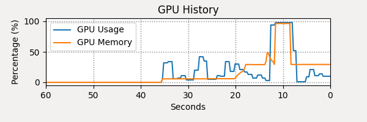
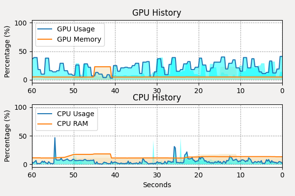

# cpu-gpu-monitor-python
cpu-gpu-monitor-python

# dependences

* GPUtil
* psutil : https://psutil.readthedocs.io/en/latest/

# GPU monitor

# CPU and GPU monitor

# use as application

you can change the run.sh file and the application configuration file to make it an application to allow easy usage.
